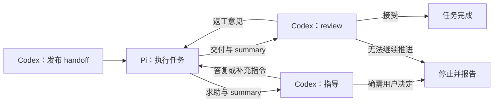

# Codinator 交接协议与任务推进改造计划

- 日期：2026-10-03。
- 状态：设计计划，尚未实施；本文件不授权派发任务、增加预算或改变运行权限。
- 现状核对基线：`708877fa2beedd879ef53786aafab27aa2c0e9d0`。
- 依据：用户关于 Codinator 功能范围的讨论，以及对当前实现的核对。

## 1. 定位与成功标准

Codinator 为 Codex 与 Pi 提供 handoff、summary、review 和指导意见的交接规范与可靠传递机制。它应保证：任务未结束时，始终明确下一步由谁处理、需要什么输入，以及何时必须回应；任务结束或无法推进时，有可追溯的结论与继续处理所需的证据。

具体实施、项目命令、Git 操作、测试、问题诊断和验收判断由 Pi／Codex 执行。Codinator 负责提供文档模板与提示词、维持流程、校验交接格式、管理进程与预算。文档内容是否合格由 Codex／Pi 判断并负责；控制器不自行解决业务问题，也不根据代理自报的测试结果判断任务正确。

“持续推进”不保证任何任务都能成功。它要求任务在授权和预算内持续交接；完成、明确取消、需要用户决定或预算耗尽时，按已声明的规则停止并报告，不能无声停在无人处理的中间状态。

| 角色 | 职责 |
| --- | --- |
| 主 Codex／指导 Codex | 明确需求、拆解任务、准备 handoff，检查交接是否足够，回答 Pi 的技术求助，决定如何继续或是否需要用户介入 |
| Pi + Bonsai | 实施具体任务，执行约定操作，记录真实结果，交付产物与 summary，遇阻主动提出具体问题 |
| 独立 Codex | 对照原始要求核验产物、必要证据与验收标准，给出接受、返工或无法继续验收的结论 |
| Codinator | 传递和持久保存交接，核对身份与格式，记录进程终态，控制预算与单写入者，按明确结果流转 |

指导者如果参与实质设计或修复，最终验收仍交给非作者 Codex。交接指令不能自行增加权限或预算；能够在既有授权内由 Codex 解决的技术问题，不应直接转为要求用户处理。

## 2. 当前实现与缺口

上一轮改造已移除控制器直接执行项目测试、Git 操作、源码快照和自动集成的路径，保留 Pi 实施与独立 Codex 审查。当前尚有以下缺口。

| 部分 | 基线中的实际行为 | 计划取舍 |
| --- | --- | --- |
| 正常返工 | Pi 交付后调用独立 Codex，`needs_changes` 在预算内交回 Pi | 保留并完善交接证据 |
| 遇阻求助 | Pi 的 `blocked` 或软检查的 `needs_guidance` 导致停止，等待主会话处理 | 增加 Codex 接收问题、返回指导、再交回 Pi 的闭环 |
| handoff | 校验文件存在、路径和可修改范围，不校验任务描述、验收标准等内容 | 提供栏目模板与主 Codex 自检提示词，程序仅校验格式 |
| summary | 提示词要求说明改动、检查、失败等；程序只要求文本非空 | 提供栏目模板与 Pi 如实记录提示词，增加格式校验和持续留存规则 |
| review | 已要求结论、问题、修改建议和验证方式 | 将内容核验责任写入 Codex 模板提示词，控制器继续只校验协议 |
| 执行规范 | 强制 Git 分支、SHA、非空检查列表，提示词固定大量 Git 步骤与模型参数 | 本轮保留现行开发契约；通用任务支持与配置整理作为后续工作 |
| 中断 | 保留进程记录并停止，不保证代理已输出最终小结 | 区分最终小结、最近阶段小结与控制器观察到的停止事实 |

核对入口：[任务流转](../src/codinator/engine.py)、[manifest 校验](../src/codinator/config.py)、[交付与 summary 校验](../src/codinator/delivery.py)、[代理与 review 规范](../src/codinator/agents.py)、[软检查](../src/codinator/checkpoints.py)、[进程退出处理](../src/codinator/process.py)。现行操作仍以 [主界面协议](codex-interface.md) 为准。

## 3. 交接模板、内容责任与格式规范

Codinator 提供交接文档模板及供 Codex、Pi 遵循的提示词，并仅校验文档结构、字段类型、协议身份、引用绑定及证据完整性。内容是否清楚、真实、充分、可执行，或是否满足任务要求，由相应 Codex、Pi 判断并负责。格式通过仅表示文档可被协议接收，不表示内容合格或任务通过验收。

以下内容要求用于指导文档作者和接收方，控制器不能判断是否在语义上满足这些要求。栏目齐全但内容含糊时，只要符合已声明的格式规则，仍应通过格式校验；主 Codex 检查 handoff，Pi 自检 summary 与求助，接收的 Codex 核验实施者陈述，独立 Codex 负责最终验收。

### 3.1 handoff

handoff 至少包含：

- 任务目标：要解决的问题和期望结果。
- 范围与限制：允许做什么，哪些边界不能改变，已有授权是什么。
- 必要输入：工作上下文、依赖和稳定引用；不适用时明确说明。
- 交付物：应产生什么，保存在哪里，如何定位和核验。
- 验收标准：能够逐项判断的条件，必要时为条件分配稳定标识。
- 交接规则：何时提交、何时求助、summary 应交到哪里、由谁处理。

主 Codex 发布前检查上述内容是否足以开始执行。固定 Git 流程、测试命令和资源限制可作为开发任务的附加要求，不能用一组存在但含糊的字段冒充可执行 handoff。

### 3.2 Pi summary 与求助

summary 至少包含当前状态、已完成事项、未完成事项、尝试及实际结果、产物与证据位置、已知偏差或未知项，以及下一步建议。相关项没有内容时可明确写“无”或“未执行”，不能为满足格式而编造事实。

求助还须说明：具体卡在哪里、已经尝试过什么、观察到什么结果、需要 Codex 回答哪个问题。Pi 应在契约不清、相同尝试反复失败或缺少继续推进依据时主动求助，不必等到硬上限。

summary 是实施者的陈述。它帮助 Codex 定位证据和理解过程，不直接证明完成或通过验收。

### 3.3 Codex review

review 至少包含：

- 审查对象：对应哪次交付及其产物身份。
- 结论：接受、需要返工，或明确需要用户／外部条件才能继续。
- 判断依据：对应哪些验收条件，核实了哪些产物和证据，哪些仍未核实。
- 返工意见：需要修改的具体问题、依据、可执行的修正提示和复验要求。
- 停止原因：如果无法继续，谁需要提供什么信息、权限或资源。

沿用现有 `accepted` 和 `needs_changes` 的语义。技术求助不应被混同为人工介入；最终序列化字段在实施前统一，不因本文件出现某个逻辑状态名就宣称已有对应 API。

接受必须基于原始要求和必要核验，不能仅凭 summary 或“测试全绿”；返工不能只给出笼统的“继续完善”。审查者不得在每轮自行增加原契约没有的验收要求。

### 3.4 Codex guidance

指导意见至少说明回答的是哪个问题、建议怎样继续、依据或反例、仍未知的事项，以及何时应再次求助或停止。

指导作为同一任务的新交接记录追加，关联原问题、任务和契约版本，不覆盖原 handoff。补充解释与反例不要求重建任务；改变验收标准、扩大权限或增加预算时，走明确的契约变更和授权流程。

### 3.5 模板与提示词

本轮交付 handoff、summary、求助、review、guidance 五类模板。阶段小结复用 summary 栏目，并注明对应检查点。模板须包含规定栏目和供对应代理遵循的提示词，不能只有空标题；下列提示词作为各模板的基础指令，结合本节内容要求使用。

| 模板／作者 | 模板中的提示词 |
| --- | --- |
| handoff／主 Codex | 发布前检查目标、范围、输入、交付物和验收条件是否足以执行；补齐会阻碍执行的信息，明确已有授权及交接规则。不要以栏目齐全代替内容自检。 |
| summary／Pi | 区分实际完成、已经尝试、未执行和未知事项；记录观察到的结果，引用真实产物和原始证据；没有内容时如实写“无”或“未执行”，不得编造事实或自行宣称通过验收。 |
| 求助／Pi | 说明具体阻塞、已尝试的方法、实际结果和需要 Codex 回答的问题；提交明确的求助控制字段及当前 summary，不通过求助扩大权限或预算。 |
| review／独立 Codex | 对照原始契约核验产物与原始证据；将 summary 视为待核实陈述，说明已核实和未核实部分；返工给出具体问题、修正提示和复验要求，不新增验收条件。 |
| guidance／指导 Codex | 回答关联求助中的具体问题，说明建议、依据、未知项及继续、再次求助或停止的条件；提交明确的处理结果，遵守原有权限和预算。 |

模板版本及实际交付给代理的提示词随对应交接留存，便于核对代理收到的要求。更新模板不追溯改写已发布 handoff 或历史消息。提示词指导代理行为，控制器不判断代理是否在语义上遵循了提示词。

### 3.6 格式与工具

身份、消息类型、回复对象、版本和目标位置等控制字段严格校验，由绑定工具尽量自动填写。正文校验仅检查已声明的必要栏目及非空等结构规则，允许自由补充，不按措辞、关键词、篇幅或内容评分判断质量。明确标记“无”“未执行”的栏目可通过格式校验，其语义是否适用由代理判断。

协议字段间的身份一致性、结果枚举与允许的状态转换可以严格校验；引用绑定与文件哈希一致不代表证据真实、相关或充分。固定字段与正文栏目采用何种表示、哪些正文栏目允许为空，在实施前统一为明确的格式规则，不让程序猜测正文含义。

格式不合格时返回具体字段错误，优先让原会话当场修正。保留现有绑定提交工具的优点；退出后的补交作为有界兜底，只整理已有证据，不编造结果或重做执行状态不确定的操作。

## 4. 求助、审查与继续执行的闭环

每个未结束的交接须记录当前处理方、待处理内容、回复关联和回应边界。接收确认、代理实际完成、任务验收是不同事实，不能把“通知已发送”当成求助已解决。

流程图中的技术求助、继续执行、需要用户／外部条件和无法继续等判断由 Pi／Codex 作出，并通过明确的消息类型或处理结果字段提交。控制器只核对字段、回复关联及允许的状态转换，再按规则调度；不能阅读正文后自行分类阻塞、判断指导有效性或推断实质进展。进程退出、超时和预算耗尽等运行事实仍由控制器记录和处理。新增控制字段及其取值在实施前确定，本图不定义已有 API。

为自动指导指定可被调度的 Codex 接收方。主会话不在线时，也应有明确的处理或等待路径；不能只有通知，没有答复回收机制。技术指导必须在既有授权内进行。

交接时维持单写入者，确认停止或进入约定的安全边界后再交给可能修改工作目录的处理者。选择继续原 Pi 会话还是新建 attempt，属于进程适配与恢复设计；不应把每次求助都定义成任务失败。

求助、指导、补交与重试共享任务总预算。实现前明确这些交接如何计入 attempt 与实施轮次，不能通过新消息、新会话或新 task ID 重置已用额度。重复出现同一阻塞时，由 Codex 判断是否更换指导、拆解或停止；控制器不根据日志活跃程度推断实质进展。

## 5. 持续 summary 与中断处理

| 时点 | 预期行为 |
| --- | --- |
| 正常完成、主动求助或主动停止 | 代理提交明确状态及 summary，负责正文与状态的语义一致性；完成时附交付物及必要证据 |
| 软检查点 | 代理留下阶段小结，包括真实进展、尝试、阻塞和下一步；格式合法且明确声明继续时，在进程、权限和预算规则允许下继续，不一律重启 |
| 接近硬上限 | 在已有预算内提前请求收尾并留出小结时间，不因此延长硬上限 |
| 崩溃、断连、强制终止 | 保留最近小结与原始进程记录，明确最终小结缺失，不能伪造代理结论 |
| 需要事后调查 | Codex 根据现场与日志形成补充判断，注明作者、依据与未知项 |

当前试点的每30分钟软检查、单进程90分钟硬上限可继续作为任务配置；它们不是通用交接规范必须写死的数值。控制器无法保证已终止的代理补写 summary，应如实保留缺失情况。

## 6. 本轮边界与后续整理

本轮聚焦模板与提示词、格式校验、求助指导闭环和小结留存。通用任务支持、固定开发流程的移出及模型配置整理不作为本轮完成条件；它们在闭环试点后作为后续工作另定范围和兼容方案。职责划分本身不要求移除现有 Git 身份和检查字段：校验 SHA 格式、身份绑定和证据完整性仍属于协议职责，真实 Git 状态与检查结果由 Pi／Codex 核实。

| 当前固定要求 | 调整方向 |
| --- | --- |
| 所有任务必须有 Git 分支、候选 SHA、非空测试命令 | 后续为通用任务另定适用契约；现行 v2 保留原字段和要求，不强迫不适用任务填写虚假检查 |
| 提示词中固定的大段 Git 操作步骤 | 后续整理到项目 AGENTS.md 或开发 handoff 模板，由控制器完整传递；本轮保留原要求 |
| 所有审查一律重跑全部指定命令 | 本轮继续执行已声明的必需验证；后续由适用任务契约表达验证策略，其他由 Codex 按风险选择 |
| 各类异常统一停止并等人工恢复 | 本轮按代理提交的明确处理类型及控制器记录的运行事实分流，明确下一处理方 |
| 特殊且复杂的交付修复阶段 | 优先原会话补正，退出后修复保留有限兜底，逐步减少独立分支 |
| 核心逻辑中写死模型和推理级别 | 后续移到明确运行配置，保持现有默认选择与身份核验，不静默换模型 |

后续“移出”不等于取消现有项目要求。须明确与现行 v2 契约及项目 AGENTS.md 的兼容边界；AlphaLab 的 Git 提交、SHA 绑定、数据与验收规则仍由该项目契约约束，不能借此降低已发布任务的验收标准或放宽实际权限。

以下能力直接支撑可靠交接，应保留：持久状态、消息身份和关联、原始证据、进程终态确认、单写入者、暂停与取消、预算和硬上限、受授权范围约束的隔离，以及禁止盲目重放执行结果不确定的操作。控制器可以校验证据完整性，不能据此声称已经核实业务正确性。

不为此次改造增加通用插件平台、分布式调度、任意工作流引擎或新的源码版本管理器。优先使用当前所需的少量消息类型与明确状态转换。

## 7. 实施顺序与验收

以下工作包按依赖顺序实施；本计划不分配新的执行预算。

| 顺序 | 工作包 | 完成依据 |
| --- | --- | --- |
| 1 | 五类模板、提示词与统一交接工具 | 模板包含规定栏目及角色提示词；缺少目标／验收标准等规定栏目或字段时报告格式错误；summary 缺项得到可修正提示；无内容项可如实标记；身份和目标位置由工具绑定 |
| 2 | 求助与指导闭环 | Pi 求助可被 Codex 接收、答复并传回 Pi；按代理提交的明确处理字段流转，正常技术阻塞不必等待用户；消息有处理方与回复关联；不能通过求助改变授权和预算 |
| 3 | 持续小结与中断恢复 | 正常结束和主动求助有小结；软检查记录可定位；硬中断保留最新小结及明确缺失标记；重复通知、断连或重启不导致盲目重放 |
| 4 | 有界真实工作包试点 | 在事先确定的授权和预算内观察闭环效果，由 Codex 核验代理内容与结果，记录失败和人工介入原因，不以模拟测试代替真实代理验证 |

格式校验须验证职责边界：缺少规定栏目或字段时返回具体错误；栏目齐全、类型合法但正文含糊时通过格式校验，内容问题交由代理审查；“无”“未执行”等如实标记不因措辞被拒绝。格式测试不能证明内容合格，真实试点中由 Codex 核验内容并形成审查结论。

生命周期、持久化和隔离的实质变化继续要求针对性故障测试与非作者独立审查。测试重点包括重复或迟到回复、缺失小结、交接丢失、进程中断、过期结论、权限／预算边界和同一任务多个写入者。

试点至少记录：技术求助能否完成 Codex→Pi 回传、人工介入次数及原因、格式错误消耗的时间与轮次、重复阻塞情况，以及停止后是否有足够证据继续处理。先记录可比较的基线，不预设尚未获证据支持的改善幅度。

## 8. 历史与实施边界

保留已发布契约、旧任务状态、轮次、预算、summary、review 和原始证据，不追溯改写。当前 v1 任务仍为只读历史；后继任务须核算剩余授权，不能用新任务默认值替代旧账目。

实施前确定最小消息字段、Codex 指导的接收方式、交接与轮次的计数规则，以及正常收尾与强制终止的处理边界。尚未支持的逻辑状态、字段和流程应在发布文档中明确标为待实现，不能提前写成已可调用的能力。
